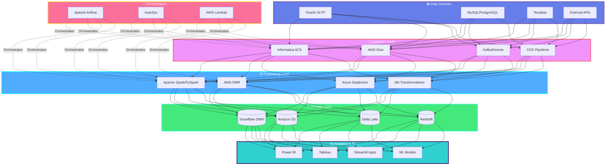
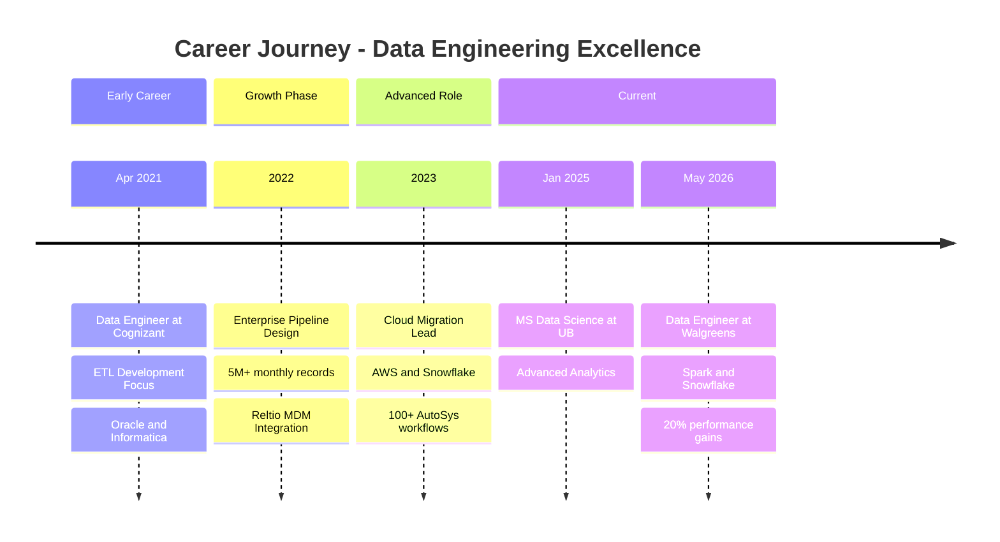
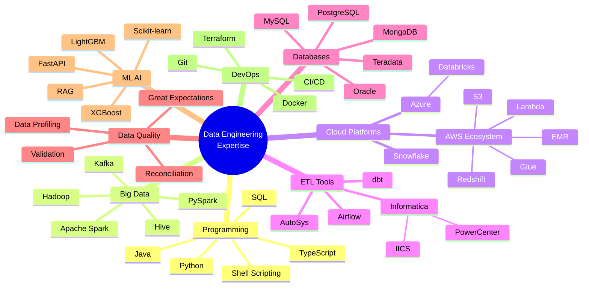

---

## 🎯 Professional Summary

**Enterprise Data Engineer** | **Cloud Data Architect** | **ETL/ELT Specialist**

Results-driven Data Engineer with **4+ years** of experience designing and implementing enterprise-scale data pipelines, cloud-based ETL/ELT workflows, and analytical data platforms. Currently pursuing **MS in Data Science** at University at Buffalo (Spring 2025). Proven expertise in building distributed data processing systems handling **5M+ records monthly** across **Oracle, Snowflake, AWS, and Azure** ecosystems.

**Core Competencies:**
- 🏗️ **Data Architecture:** Medallion Architecture, Data Lake, Star Schema, 3NF Modeling
- ⚡ **Performance Optimization:** 60% query performance improvement, 20% analytical query tuning
- 🔄 **Pipeline Orchestration:** 100+ production workflows via Airflow & AutoSys
- 📊 **Data Quality:** Data Validation, Profiling, Reconciliation, Lineage, Governance
- ☁️ **Cloud Platforms:** AWS (S3, Glue, EMR, Redshift, Lambda), Azure Databricks, Snowflake
- 🎓 **Certifications:** 2x Reltio MDM Specialization Certified

---

## 🏛️ Enterprise Data Architecture

---

## 💼 Professional Experience Timeline

---

## 🛠️ Technology Stack & Expertise

---

## 📊 Technical Skill Distribution

### **Primary Technology Stack**

| **Category** | **Technologies** | **Proficiency** |
|:------------|:----------------|:---------------:|
| **Languages** | Python, SQL, Java, TypeScript, Shell | ████████████ 95% |
| **Big Data Frameworks** | Spark, PySpark, Hadoop, Hive, Flink | ███████████░ 90% |
| **Cloud Platforms** | AWS, Azure, Snowflake | ███████████░ 90% |
| **ETL/ELT Tools** | Informatica, dbt, Airflow, Glue | ████████████ 95% |
| **Databases** | Oracle, PostgreSQL, MySQL, MongoDB | ███████████░ 88% |
| **Data Quality** | Great Expectations, Validation, Profiling | ██████████░░ 85% |
| **ML/AI** | Scikit-learn, LightGBM, XGBoost, RAG | █████████░░░ 75% |
| **DevOps** | Docker, Git, CI/CD, Terraform | ██████████░░ 80% |

---

## 🚀 Featured Enterprise Projects

### 1️⃣ **TIDE-HF — Clinical Decision Support Platform**

**End-to-end OLTP-to-OLAP healthcare data pipeline** processing **546K+ clinical admissions** with advanced ML prediction capabilities.

**Technical Highlights:**
- 🔄 Built automated cohort extraction across **60+ ICD codes** and **70+ laboratory analytes**
- 🧠 Engineered **108 temporal features** for multi-label prediction
- 🎯 Achieved **0.78–0.98 AUROC** across hyperkalemia, AKI, and heart failure prediction
- 📊 Implemented **dbt-based transformations** producing **137K-visit training dataset**
- 🤖 Developed **RAG-powered clinical recommendations** with XGBoost mortality risk module
- ☁️ Deployed **AWS S3-based cloud storage** for scalable data processing

**Tech Stack:** `Python` `LightGBM` `FastAPI` `ChromaDB` `RAG` `MCP` `TypeScript` `PostgreSQL` `dbt` `Streamlit` `XGBoost` `AWS S3`

---

### 2️⃣ **E-Commerce Retail Analytics Database**

**High-performance retail analytics pipeline** processing **100K+ orders** and **3M geolocation records**.

**Technical Achievements:**
- 📐 Designed **normalized 3NF database model** for structured retail analytics
- 🔧 Developed complex **SQL transformations, joins, and aggregations**
- ⚡ Optimized queries and indexes achieving **60% faster execution**
- 🐳 Containerized with **Docker** for reproducible deployment
- 📊 Integrated order, customer, product, seller, and geolocation datasets

**Tech Stack:** `Python` `Pandas` `PostgreSQL` `SQL` `Docker`

---

### 3️⃣ **Enterprise Banking Microservices Platform**

**Distributed microservices architecture** implementing enterprise banking operations with robust security.

**Architecture Components:**
- 🏗️ **Service Registry:** Eureka-based service discovery
- 🔐 **API Gateway:** Centralized authentication with Keycloak
- 💾 **Database per Service:** MySQL instances for data isolation
- 🔄 **Event-Driven:** Kafka-based inter-service communication

**Microservices:**
- 👤 User Service: Registration, authentication, profile management
- 💳 Account Service: Account creation, transaction history, closure
- 💸 Fund Transfer Service: Inter-account transfers, transaction records
- 📊 Transaction Service: Deposits, withdrawals, detailed reporting

**Tech Stack:** `Java` `Spring Boot` `Spring Cloud` `MySQL` `Docker` `Keycloak` `Kafka`

---

### 4️⃣ **SQL Data Warehouse - Medallion Architecture**

**Modern data warehouse** implementing Bronze-Silver-Gold architecture on SQL Server.

**Layer Architecture:**
- 🥉 **Bronze Layer:** Raw CSV ingestion from ERP/CRM systems
- 🥈 **Silver Layer:** Data cleansing, standardization, normalization
- 🥇 **Gold Layer:** Star schema for optimized analytics

**Tech Stack:** `TSQL` `SQL Server` `Python` `ETL Pipelines`

---

## 💼 Professional Experience Deep Dive

### 🏢 **Data Engineer @ Walgreens** | *May 2026 – Present*

**Enterprise-Scale Data Engineering:**
- ⚡ Developed **Python/SQL/AWS/Snowflake ETL/ELT pipelines** supporting scalable analytical workloads
- 🔥 Engineered **Apache Spark/PySpark** workflows for large-scale distributed processing
- 📊 Optimized **Snowflake data warehouses** achieving **20% query performance improvement**
- ☁️ Built **AWS S3-Snowflake integration** for enterprise data movement
- 🎼 Orchestrated **100+ production workflows** via Airflow and AutoSys
- ✅ Implemented comprehensive **data quality controls** improving reliability
- 🔧 Troubleshot production issues improving **pipeline stability by 15%**

**Key Technologies:** `Python` `SQL` `AWS` `Snowflake` `Apache Spark` `PySpark` `S3` `Airflow` `AutoSys`

---

### 🏢 **Data Engineer @ Cognizant Technology Solutions** | *Apr 2021 – Jan 2025*

**Enterprise ETL & MDM Expertise:**
- 🔄 Developed **Informatica PowerCenter/IICS workflows** processing **5M+ monthly records**
- 🗄️ Integrated **Oracle, MySQL, PostgreSQL, Teradata, Snowflake** data sources
- 🎯 Implemented **Reltio MDM** for **9M+ mastered records** improving consistency
- 📊 Built complex **SQL transformations** analyzing **50K+ daily records**
- ⚙️ Managed **100+ AutoSys batch workflows** ensuring timely delivery
- 🏗️ Supported **Snowflake/Oracle/Teradata** warehouses with optimization
- 🤝 Collaborated with stakeholders translating requirements to ETL workflows
- 🐍 Supported analytics using **Python/SQL** for structured datasets

**Key Technologies:** `Informatica PowerCenter` `IICS` `Oracle` `MySQL` `PostgreSQL` `Teradata` `